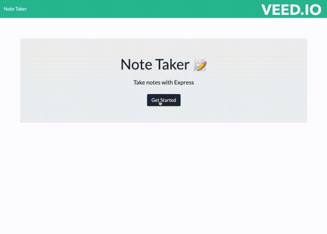

## Description

In this challenge, the goal was to fulfill the user's need for a note-keeping application that could store past notes and delete older notes if need be. The purpose of this build was to provide a clean and simple notes application for keeping track of whatever the user may need to use it for: making lists, jotting down thoughts, remembering random important items. Notes should remain with the server after closing the application as well.
- What problem does it solve? This application enables users to store notes within a browser window, convenient for when surfing the web or trying to keep from overloading cload storage on an already-full notes mobile notes app.

Through this process, I learned how to create routes from the server to the client and vice versa while simultaneously deploying with Heroku. Also learned the importance of file-tracking and ensuring only the appropriate files are tracked and the rest are hidden/untracked utilizing the .gitignore.

## Installation

This application will be deployed utilizing Heroku. The deployment link will be below: 

https://radiant-reaches-07834.herokuapp.com/

## Usage

Simply begin creating a title for your note (keeping it below 28 characters) and type in the body of the note to add whatever would like to be said. Click the save icon to store it in the sidebar, along with any other previously-made notes! Option to add a new note manually by clicking the "+" sign in the top right corner (not pictured/visible due to free gif-making site watermark).

